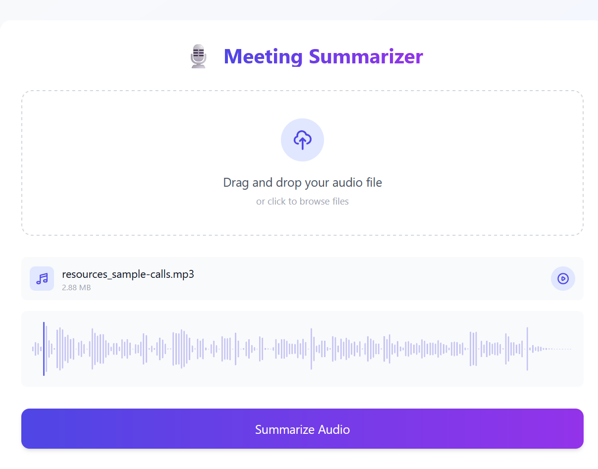
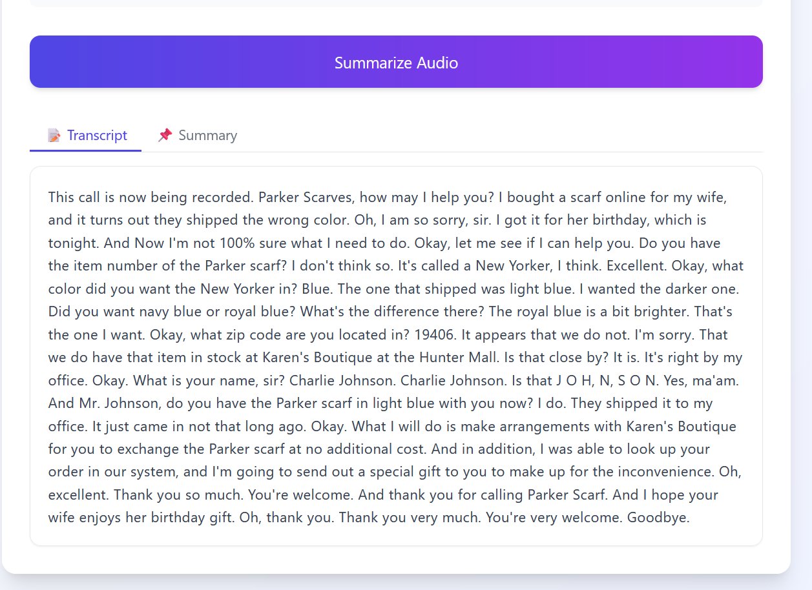
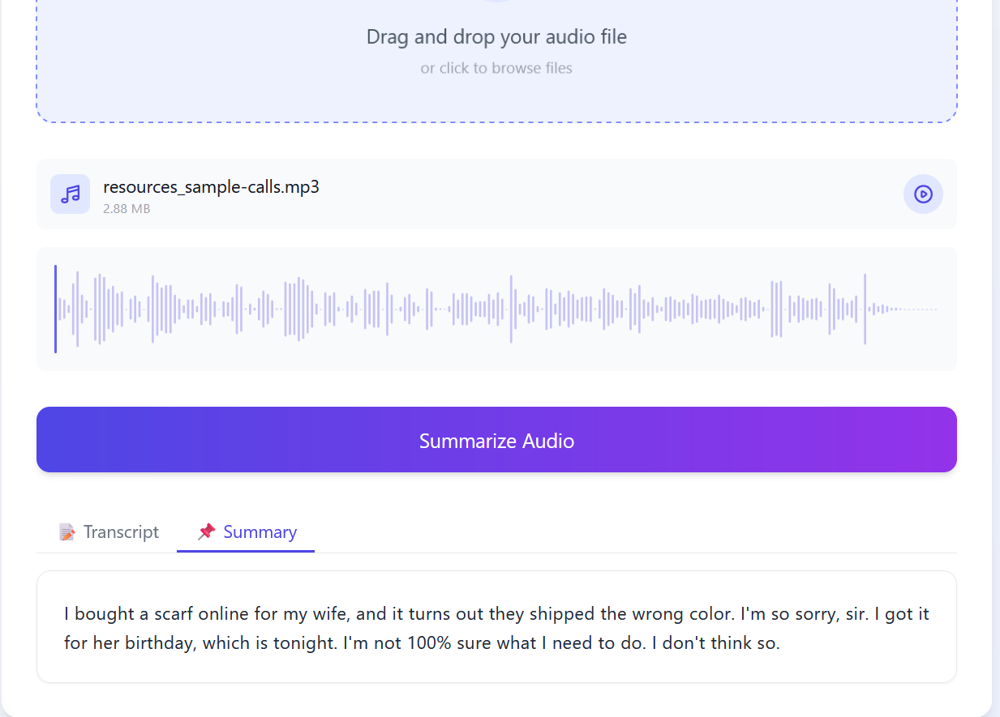

# 🎙️ Meeting Summarizer – AI-Powered Audio-to-Summary Web App

An intelligent web application that **transcribes**, **summarizes** Upload an audio recording of a meeting, lecture, or conversation and receive a concise summary and full transcript instantly.

---





## 🚀 Features

### 🔧 Backend (FastAPI + TensorFlow)
- **/transcribe**: Upload audio and receive transcribed text (via AssemblyAI).
- **/summarize**: Input text and receive a summary using TensorFlow-based models (T5/BART).
- **/process**: Unified endpoint for transcription + summarization.

### 💡 Frontend (React + TailwindCSS)
- Drag-and-drop audio upload UI.
- Waveform audio preview with WaveSurfer.js.
- Beautifully formatted transcript and summary display.
- Minimalistic, modern, and responsive layout.
- One-page app for ease of use.

---

## 🧠 Tech Stack

| Layer      | Technology            |
|------------|------------------------|
| Frontend   | React, TailwindCSS, WaveSurfer.js |
| Backend    | FastAPI, TensorFlow, HuggingFace Transformers |
| AI Models  | AssemblyAI, T5/BART ,or langchain can be used|

---

## 📦 Getting Started

### ✅ Prerequisites
- Node.js v18+
- Python 3.10+

### 🔧 Backend Setup

```bash
cd backend
pip install -r requirements.txt
uvicorn main:app --reload
```
### 🌐 API Endpoints

| Method | Endpoint         | Description                          |
|--------|------------------|--------------------------------------|
| POST   | `/transcribe`    | Upload audio file, get transcript    |
| POST   | `/summarize`     | Input text, get summarized version   |
| POST   | `/process`       | Upload audio, receive transcript + summary |


### 📌 Roadmap

- Audio file drag and drop

- Waveform audio visualization

- AssemblyAI-based transcription

- Summarization using T5/BART

- Real-time transcription (/stream-transcribe)
